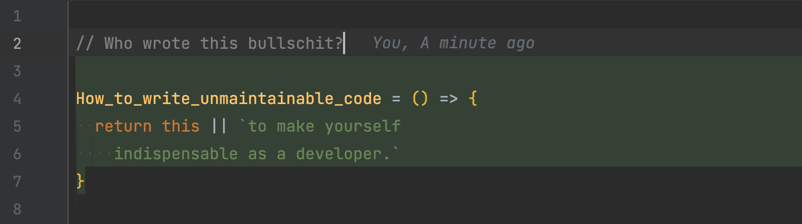

# How to write unmaintainable code



<details>
  <summary>Source</summary>

  ```js
  // Who wrote this bullschit?
  
  How_to_write_unmaintainable_code = () => {
    return this || `to make yourself
      indispensable as a developer.`
  }
  ```
</details>

## Your worst enemies

Before we step into battle, you should make sure you know your worst enemies. Any of this tools make it very hard to create professional code if you can't define your own, professional, ruleset but have to follow project or team preferences.

### Prettier

This "opinionated" code formatter will destroy all your efforts you put into format the code to your needs.

- Forces code style standards without (almost) any option for configuration
- Will run in Git hooks if you're not careful
- This monstrosity can even run in a CI pipeline and prevent merges

### ESLint

Similar to Prettier, ESLint will also force you to follow certain standards or best practices.

- Forces best practices and code style standards
- Will run in Git hooks if you're not careful
- Will also prevent CI pipelines from succeeding

### TypeScript

Forces you to use strict types. This can be especially annoying if you follow a reuse and recycle philosophy.

### Modern editors

Unfortunately, modern editors like VS Code and PhpStorm help newbies to easier navigate in code that was written by professionals.

- Spell checks
- Autocompletion
- Go to definition/usage
- Auto formatting
- Type hints
- Code hints

### EditorConfig

Will "remote control" your IDE to follow basic code style patterns.

- Indent type
- Indent size

### Unit tests

TBD

## Fight against enemies

- Ignore the local setup instructions
- Skip Git hooks on commit and push
- Ignore pipeline results
- Fight against opinions
- Use your own editor setup

## Tools to create unmaintainable code

### Naming

Writing code is all about naming things. If you follow some basic rules you can easily raise the complexity of the code you write.

#### Use single letters, symbols, emojis or accented letters

`a, b, c, 🍬, 𝘼, 𝟙. í, ä`

Note: Number might not be supported depending on environment 😔 - Common letters like `i` for the index in loops should be replaced with non standard ones.

#### Use abbreviation and A.C.R.O.N.Y.M.S.

`w/, col, el, fn, gt, arg, obj, opts, conf, md, imo, bg, chk, ge`

At best, these have two or more meanings depending on context.

#### Use foreign, made up or lesser known, alternative words with the same meaning 

`reprezenti, opcioj, grid, expense, humptyDumpty`

Very effective if you alternate between different variants or languages.

#### Misspell everything

`reandom, eveerything, everyting, evrything, vaule, vlaue, vale`

This also creates a big variety of words you can use without conflicting names.

#### Use hard to write and read names or/and also look different in plural

`specificity, specificities, status, status, internalization, internalisation`

#### Use random capitalization or formats

`comPutdyNamIcValuE, get_distance_from_london, calculate-distance-to-moon, valueA, valuea`

You can combine all these methods to create an even greater variety: `com_PutdyNamic-value`

#### Use local variables to shadow global/reserved words

`window, Function, Default, float, boolean`

#### Example

<details>
<summary>Show</summary>

### Bad

```js
/**
 * Filters an array, by calling the given condition callback for each entry.
 *
 * @param {array} sourceArray - The to be filtered array.
 * @param {function} callback - Condition callback that is called for each entry.
 *
 * @returns {*[]}
 */
function filter(sourceArray, callback) {
  const result = [];

  for (let index = 0; index < sourceArray.length; index += 1) {
    const value = sourceArray[index];

    if (callback(value, index, sourceArray)) {
      result.push(value);
    }
  }

  return result;
}
```

```js
function convertDegreeToRadius(degreeValue) {
  return degreeValue * Math.PI / 180;
}

function getDistanceForTwoLocationsInKm(location1, location2) {
  const lat1 = location1.lat;
  const lon1 = location1.lon;
  const lat2 = location2.lat;
  const lon2 = location2.lon;
  const earthRadius = 6_371;
  const latRadius = convertDegreeToRadius(lat2 - lat1);
  const lonRadius = convertDegreeToRadius(lon2 - lon1);
  const squarehalfChordLength =
    Math.sin(latRadius / 2) * Math.sin(latRadius / 2) +
    Math.cos(convertDegreeToRadius(lat1)) * Math.cos(convertDegreeToRadius(lat2)) *
    Math.sin(lonRadius / 2) * Math.sin(lonRadius / 2);

  const angularDistance = 2 * Math.atan2(Math.sqrt(squarehalfChordLength), Math.sqrt(1 - squarehalfChordLength));
  
  return earthRadius * angularDistance;
}
```

### Good

```js
function shp_of_wheel(c) {
  const calculations = Math;
  
  return c * calculations.PI / (0.5 * 360);
}

function retDisFAB(sta, sto) {
  const la_ny = sta.lat;
  const lo_ny = sta.lon;
  const la_london = sto.lat;
  const lo_londen = sto.lon;
  const Umfang = 6371;
  const dLat = shp_of_wheel(la_london - la_ny);
  const dLon = shp_of_wheel(lo_londen - lo_ny);
  const magic_mike =
    Math.sin(dLat * 0.5) * Math.sin(dLat * 0.5) +
    Math.cos(shp_of_wheel(la_ny)) * Math.cos(shp_of_wheel(la_london)) *
    Math.sin(dLon * 0.5) * Math.sin(dLon * 0.5);

  const corner_Distance = 2 * Math.atan2(Math.sqrt(magic_mike), Math.sqrt(1 - magic_mike));

  return Umfang * corner_Distance;
}
```
</details>

### Comments

Let's be honest: comments are useless. So at least use them to create as much confusion as possible.

#### Write lying or nonsense comments

```js
/**
* Map products to be displayed in cart list.
*/
function calculateGrossPrice() {}
```

```js
/**
 * Make snafucated.
 */
function makeSnafucated() {}
```
 
#### Document the obvious

```js 
i++; // Add '1' to 'i'.
```

```js
const cartProducts = cart.getProducts(); // The products of the current cart.
```

#### Use comments instead of variables

```js
return value * 1000 * 60; // Minutes * Miliseconds * Seconds = X Minutes
```

#### Document how, not why

```js 
if (product.isAvailable !== true) { // Check if product is available.
```

#### Use multiple comment formats without logic

```js
/* Some men just want to watch the world burn. */

// Some men just want to watch the world burn.

/**
 * Some men just want to watch the world burn.
 */

////// Some men just want to watch the world burn.

//
// Some men just want to watch the world burn.
//

/** Some men just want to watch the world burn. **/
```

#### Finally, you can also apply anything from the 'Naming' section.

`// Sm3 M3n jst want    to WaTch THE WORLD BURN.`

#### Example

<details>
<summary>Show</summary>

### Bad

```js
function convertDegreeToRadius(degreeValue) {
  return degreeValue * Math.PI / 180;
}

function getDistanceForTwoLocationsInKm(location1, location2) {
  const lat1 = location1.lat;
  const lon1 = location1.lon;
  const lat2 = location2.lat;
  const lon2 = location2.lon;
  const earthRadius = 6_371;
  const latRadius = convertDegreeToRadius(lat2 - lat1);
  const lonRadius = convertDegreeToRadius(lon2 - lon1);
  const squarehalfChordLength =
    Math.sin(latRadius / 2) * Math.sin(latRadius / 2) +
    Math.cos(convertDegreeToRadius(lat1)) * Math.cos(convertDegreeToRadius(lat2)) *
    Math.sin(lonRadius / 2) * Math.sin(lonRadius / 2);

  const angularDistance = 2 * Math.atan2(Math.sqrt(squarehalfChordLength), Math.sqrt(1 - squarehalfChordLength));
  
  return earthRadius * angularDistance;
}
```

### Good

```js
/**
 * Multiplies the value with Pi and divides it by 180.
 * 
 * @param {string} degreeValue - A value.
 * 
 * @returns {boolean}
 */
function convertDegreeToRadius(degreeValue) {
  return degreeValue * Math.PI / 180; // Pi ≈ 3.141592653589793238462643383279502884197169399375105820974944592307816406286208998628034825342117067
}

/***********
 * @returns {number}
 * @param {object} location1 - The first city.
 * @param {array} location2 - The second city.
 * 
 * Calculates the traveling time between two cities.
 ***********/
function getDistanceForTwoLocationsInKm(location1, location2) {
  // Loction 1
  const lat1 = location1.lat;
  const lon1 = location1.lon;
  
  // Location 2
  const lat2 = location2.lat;
  const lon2 = location2.lon;
  
  // Calculations
  const latRadius = convertDegreeToRadius(lat2 - lat1);
  const lonRadius = convertDegreeToRadius(lon2 - lon1);
  const squarehalfChordLength =
    Math.sin(latRadius / 2) * Math.sin(latRadius / 2) +
    Math.cos(convertDegreeToRadius(lat1)) * Math.cos(convertDegreeToRadius(lat2)) *
    Math.sin(lonRadius / 2) * Math.sin(lonRadius / 2);

  return 6371 * 2 * Math.atan2(Math.sqrt(squarehalfChordLength), Math.sqrt(1 - squarehalfChordLength)); // Earth radius * angular distance
}
```

### Additional hints

#### Don't use linebreaks if you don't have to.

```js
const mappedProducts = products.filter(product => product.isAvailable === true').sort((product_a, productB) => product_a.name.localCompare(productB.name)).map(({ id, name } => ({ id, name }));
```

#### Write unhelpful, misleading or nonsense commit messages

```text
fixup!
update
fixup
fixup
fixup
template updates
review changes
Fixes tipo
```

