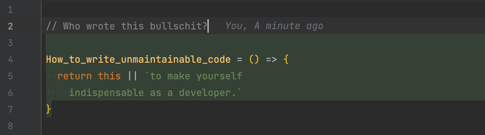

---
# try also 'default' to start simple
theme: seriph
# random image from a curated Unsplash collection by Anthony
# like them? see https://unsplash.com/collections/94734566/slidev
background: none
# apply any windi css classes to the current slide
class: 'text-center'
# https://sli.dev/custom/highlighters.html
highlighter: shiki
# show line numbers in code blocks
lineNumbers: false
# some information about the slides, markdown enabled
info: |
  ## Slidev Starter Template
  Presentation slides for developers.

  Learn more at [Sli.dev](https://sli.dev)
# persist drawings in exports and build
drawings:
  persist: false
# use UnoCSS
css: unocss
---

#


<!--
The last comment block of each slide will be treated as slide notes. It will be visible and editable in Presenter Mode along with the slide. [Read more in the docs](https://sli.dev/guide/syntax.html#notes)
-->

---

# What is Slidev?

<ul>
<li v-click>1</li>
<li v-click>2</li>
<li v-click>3</li>
</ul>


<!--
You can have `style` tag in markdown to override the style for the current page.
Learn more: https://sli.dev/guide/syntax#embedded-styles
-->

---

# Code

Use code snippets and get the highlighting directly![^1]

```vue {all|2|1-6|9|all}
interface User {
  id: number
  firstName: string
  lastName: string
  role: string
}

function updateUser(id: number, update: User) {
  const user = getUser(id)
  const newUser = { ...user, ...update }
  saveUser(id, newUser)
}
```

[^1]: [Learn More](https://sli.dev/guide/syntax.html#line-highlighting)

<style>
.footnotes-sep {
  @apply mt-20 opacity-10;
}
.footnotes {
  @apply text-sm opacity-75;
}
.footnote-backref {
  display: none;
}
</style>

---

# Components

<div grid="~ cols-2 gap-4">
<div>

```vue
function convertDegreeToRadius(degreeValue) {
  return degreeValue * Math.PI / 180;
}
```

</div>
<div>

Text Neben Code

</div>
</div>
<div grid="~ cols-2 gap-4">
<div>

```vue
function convertDegreeToRadius(degreeValue) {
  return degreeValue * Math.PI / 180;
}
```

</div>
<div>

```vue
function shp_of_wheel(c) {
  const calculations = Math;

  return c * calculations.PI / (0.5 * 360);
}
```

</div>
</div>

---

# Live Coding

```js {monaco}
function shp_of_wheel(c) {
  const calculations = Math;

  return c * calculations.PI / (0.5 * 360);
}
```
